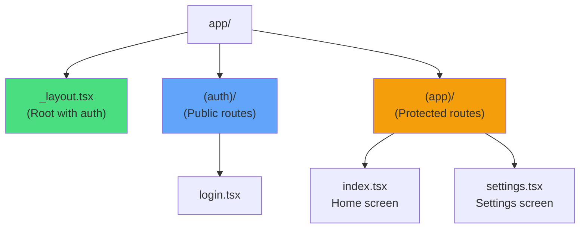
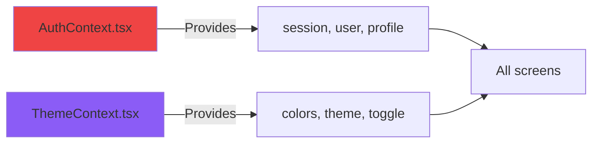
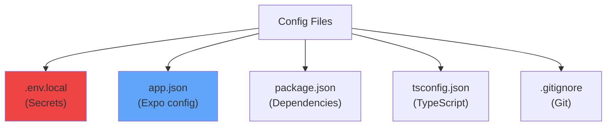
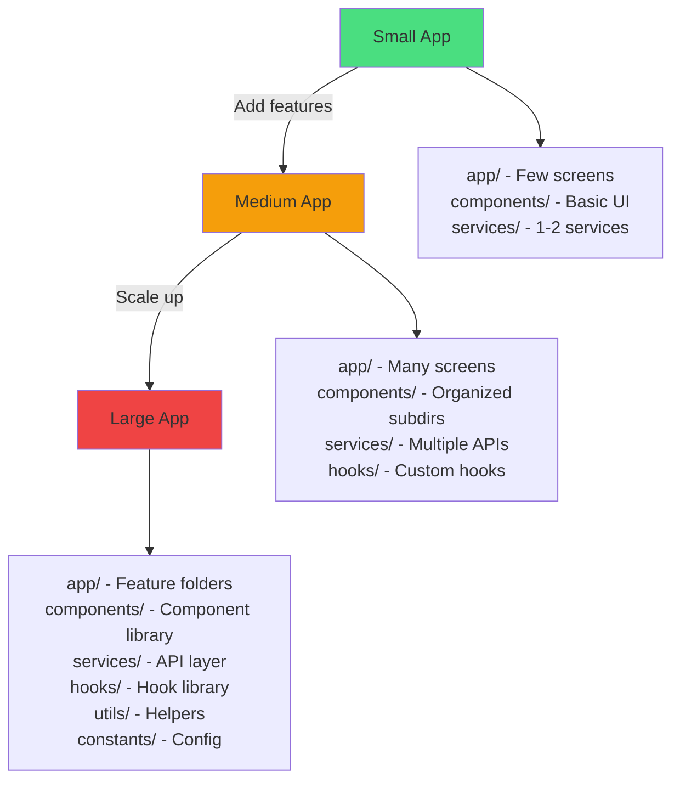

## Generated Project Layout

When you create a new app with Mobile Stack, you get a well-organized project structure:

```
my-app/
├── app/                    # Expo Router pages
├── components/            # Reusable UI components
├── context/              # React Context providers
├── lib/                  # Core libraries
├── services/            # Business logic
├── types/              # TypeScript definitions
├── supabase/          # Database migrations
├── .claude/           # AI agent configuration
├── docs/              # Project documentation
└── [config files]     # Various config files
```

## Directory Breakdown

### App Screens (`app/`)

Expo Router uses file-based routing - each file becomes a route:



<Accordion title="File details">
**`_layout.tsx`** - Root layout
- Wraps app with `AuthProvider` and `ThemeProvider`
- Handles auth redirects
- Shows loading state

**`(auth)/`** - Public routes group
- `_layout.tsx` - Auth screens layout
- `login.tsx` - Google OAuth login page

**`(app)/`** - Protected routes group  
- `_layout.tsx` - Stack navigator
- `index.tsx` - Home/dashboard
- `settings.tsx` - Settings with AI config
</Accordion>

### Components (`components/`)

Reusable UI components used throughout the app:

```typescript
components/
├── ErrorBoundary.tsx      // Catch React errors
├── ModelDropdown.tsx      // AI model selector
└── VoiceDropdown.tsx      // TTS voice selector (if enabled)
```

**When to add components:**
- UI used in multiple screens
- Complex UI that needs isolation
- Reusable form inputs
- Custom icons or graphics

### Context (`context/`)

React Context providers for global state:



<CodeGroup>
```typescript AuthContext
{
  session: Session | null
  user: User | null
  profile: AppUser | null
  isLoading: boolean
  signOut: () => Promise<void>
}
```

```typescript ThemeContext
{
  theme: 'light' | 'dark'
  colors: ThemeColors
  toggleTheme: () => void
}
```
</CodeGroup>

### Libraries (`lib/`)

Core library setup and utilities:

```typescript
lib/
├── supabase.ts           // Supabase client
│   ├── createClient()
│   ├── getGoogleOAuthUrl()
│   └── extractSessionFromUrl()
│
└── analytics.ts          // PostHog analytics
    ├── posthog instance
    ├── trackEvent()
    └── EVENTS constants
```

### Services (`services/`)

Business logic and external API integrations:

```typescript
services/
├── llm.ts               // AI model integration
│   ├── OPENAI_MODELS[]
│   ├── GEMINI_MODELS[]
│   ├── OLLAMA_MODELS[]
│   └── llmService
│       ├── saveOpenAIKey()
│       ├── getActiveProvider()
│       └── fetchGeminiModels()
│
└── tts.ts              // Text-to-Speech (if enabled)
    └── ttsService
```

**Pattern:** Each service provides a unified interface for related functionality.

### Types (`types/`)

TypeScript type definitions:

```typescript
types/
├── database.types.ts    // Auto-generated from Supabase
└── shared.ts           // Common app types
```

<Tip>
  Generate database types with: `supabase gen types typescript --project-id your-ref > types/database.types.ts`
</Tip>

### Database (`supabase/`)

SQL migrations for your database schema:

```sql
supabase/
└── schema.sql          // Initial schema with RLS policies
```

Run this in your Supabase SQL editor to create:
- User profiles table
- Row-level security policies
- Indexes
- Triggers (if needed)

### Configuration Files



<AccordionGroup>
  <Accordion title=".env.local - Environment Variables">
    ```env
    # Supabase
    EXPO_PUBLIC_SUPABASE_URL=https://xxxxx.supabase.co
    EXPO_PUBLIC_SUPABASE_ANON_KEY=eyJhbGc...
    
    # PostHog Analytics
    EXPO_PUBLIC_POSTHOG_API_KEY=phc_...
    EXPO_PUBLIC_POSTHOG_API_HOST=https://us.i.posthog.com
    ```
    
    <Warning>
      Never commit `.env.local` to git!
    </Warning>
  </Accordion>

  <Accordion title="app.json - Expo Configuration">
    ```json
    {
      "expo": {
        "name": "My App",
        "slug": "my-app",
        "version": "1.0.0",
        "orientation": "portrait",
        "icon": "./assets/icon.png",
        "scheme": "myapp",
        "plugins": [
          "expo-router",
          "expo-secure-store"
        ]
      }
    }
    ```
  </Accordion>

  <Accordion title="package.json - Dependencies">
    Only includes dependencies for features you enabled:
    - `@supabase/supabase-js` (if database enabled)
    - `posthog-react-native` (if analytics enabled)
    - `expo-secure-store` (if AI enabled)
  </Accordion>
</AccordionGroup>

## Adding New Features

### New Screen

<Steps>
  <Step title="Create file in app/(app)/">
    ```bash
    touch app/(app)/profile.tsx
    ```
  </Step>

  <Step title="Add screen code">
    ```typescript
    import { Text, View } from 'react-native';
    import { Stack } from 'expo-router';
    import { useTheme } from '@/context/ThemeContext';

    export default function ProfileScreen() {
      const { colors } = useTheme();
      
      return (
        <>
          <Stack.Screen options={{ title: 'Profile' }} />
          <View style={{ flex: 1, backgroundColor: colors.background }}>
            <Text style={{ color: colors.text }}>Profile Screen</Text>
          </View>
        </>
      );
    }
    ```
  </Step>

  <Step title="Navigate to it">
    Automatically available at `/profile`
    
    ```typescript
    import { router } from 'expo-router';
    router.push('/profile');
    ```
  </Step>
</Steps>

### New Component

<Steps>
  <Step title="Create in components/">
    ```bash
    touch components/CustomButton.tsx
    ```
  </Step>

  <Step title="Make it reusable">
    ```typescript
    import { TouchableOpacity, Text, StyleSheet } from 'react-native';
    import { useTheme } from '@/context/ThemeContext';

    interface Props {
      title: string;
      onPress: () => void;
    }

    export function CustomButton({ title, onPress }: Props) {
      const { colors } = useTheme();
      
      return (
        <TouchableOpacity
          style={[styles.button, { backgroundColor: colors.primary }]}
          onPress={onPress}
        >
          <Text style={[styles.text, { color: colors.background }]}>
            {title}
          </Text>
        </TouchableOpacity>
      );
    }

    const styles = StyleSheet.create({
      button: {
        padding: 16,
        borderRadius: 8,
        alignItems: 'center',
      },
      text: {
        fontSize: 16,
        fontWeight: '600',
      },
    });
    ```
  </Step>

  <Step title="Use anywhere">
    ```typescript
    import { CustomButton } from '@/components/CustomButton';
    
    <CustomButton title="Click me" onPress={() => alert('Clicked!')} />
    ```
  </Step>
</Steps>

### New Service

<Steps>
  <Step title="Create in services/">
    ```bash
    touch services/weather.ts
    ```
  </Step>

  <Step title="Implement service">
    ```typescript
    export const weatherService = {
      async getCurrentWeather(location: string) {
        const response = await fetch(
          `https://api.weather.com/location/${location}`
        );
        return response.json();
      },
      
      async getForecast(location: string, days: number) {
        // Implementation
      },
    };
    ```
  </Step>

  <Step title="Use in screens">
    ```typescript
    import { weatherService } from '@/services/weather';
    
    const weather = await weatherService.getCurrentWeather('New York');
    ```
  </Step>
</Steps>

## Best Practices

<Check>
✅ **Import paths**: Use `@/` alias for cleaner imports  
✅ **File naming**: Use kebab-case for files, PascalCase for components  
✅ **Colocation**: Keep related files together  
✅ **Type safety**: Define interfaces in `types/` for shared types  
✅ **Context**: Use sparingly, only for true global state  
✅ **Services**: Keep API logic out of components
</Check>

## Project Growth Pattern



As your app grows, organize by feature rather than type:

```
app/
├── (app)/
│   ├── posts/
│   │   ├── index.tsx          // List posts
│   │   ├── [id].tsx          // View post
│   │   ├── create.tsx        // Create post
│   │   └── components/       // Post-specific components
│   │       ├── PostCard.tsx
│   │       └── PostForm.tsx
│   └── profile/
│       ├── index.tsx
│       └── edit.tsx
```

## Next Steps

<CardGroup cols={2}>
  <Card
    title="Understanding Routing"
    icon="route"
    href="https://docs.expo.dev/router/introduction/"
  >
    Learn Expo Router in depth
  </Card>
  <Card
    title="Customize Your App"
    icon="paintbrush"
    href="/guides/customization"
  >
    Add your own features
  </Card>
</CardGroup>
