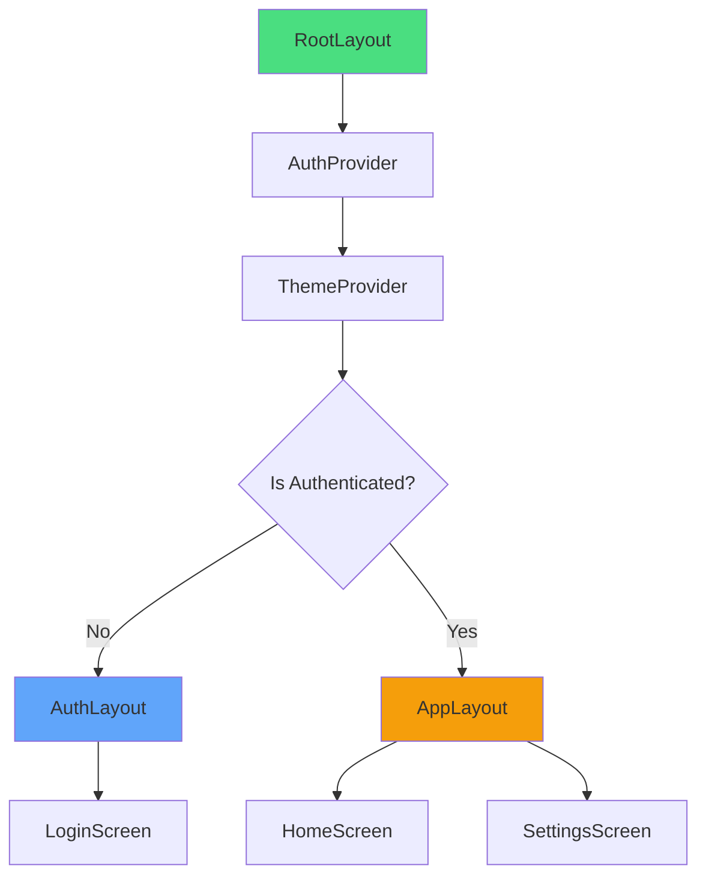

## Overview

Mobile Stack uses Expo Router's file-based navigation system with layout components that handle authentication, theming, and navigation structure.

## Root Layout

The root layout (`app/_layout.tsx`) wraps your entire app:

```typescript
// app/_layout.tsx
export default function RootLayout() {
  return (
    <AuthProvider>
      <ThemeProvider>
        <RootLayoutNav />
      </ThemeProvider>
    </AuthProvider>
  );
}
```

### Responsibilities

- Wrap app with providers (Auth, Theme)
- Handle authentication redirects
- Show loading states
- Initialize services

## Auth Layout

The auth layout (`app/(auth)/_layout.tsx`) handles public screens:

```typescript
// app/(auth)/_layout.tsx
export default function AuthLayout() {
  const { colors } = useTheme();
  
  return (
    <Stack
      screenOptions={{
        headerShown: false,
        contentStyle: { backgroundColor: colors.background },
      }}
    />
  );
}
```

## App Layout

The app layout (`app/(app)/_layout.tsx`) handles protected screens:

```typescript
// app/(app)/_layout.tsx
export default function AppLayout() {
  const { colors } = useTheme();

  return (
    <Stack
      screenOptions={{
        headerStyle: {
          backgroundColor: colors.background,
        },
        headerTintColor: colors.text,
        contentStyle: { backgroundColor: colors.background },
      }}
    />
  );
}
```

## Navigation Structure



## Custom Screen Options

Set screen-specific options:

```typescript
import { Stack } from 'expo-router';

export default function MyScreen() {
  return (
    <>
      <Stack.Screen
        options={{
          title: 'My Custom Title',
          headerStyle: { backgroundColor: '#000' },
          headerRight: () => <CustomButton />,
        }}
      />
      <View>...</View>
    </>
  );
}
```

## Navigation Helpers

```typescript
import { router } from 'expo-router';

// Navigate forward
router.push('/settings');

// Navigate back
router.back();

// Replace current route
router.replace('/home');

// Navigate with params
router.push({
  pathname: '/user/[id]',
  params: { id: '123' },
});
```

## Next Steps

<CardGroup cols={2}>
  <Card title="Expo Router Docs" icon="route" href="https://docs.expo.dev/router">
    Official Expo Router guide
  </Card>
  <Card title="Project Structure" icon="folder-tree" href="/architecture/project-structure">
    File organization
  </Card>
</CardGroup>
