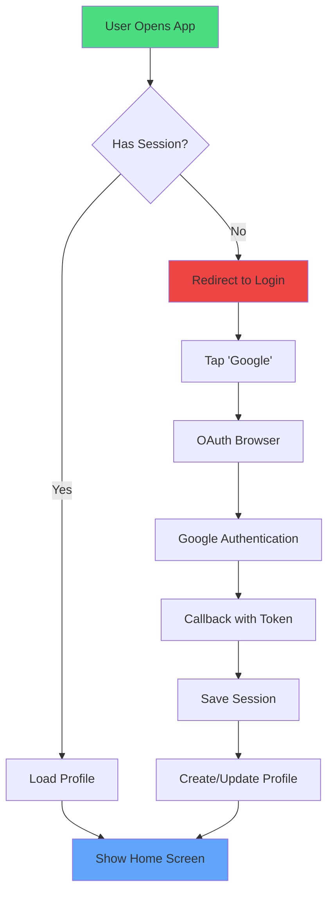

## Overview

Every Mobile Stack app includes a complete authentication system with Google OAuth integration, protected routes, and user profile management.

## Features

<CardGroup cols={2}>
  <Card title="Google OAuth" icon="google">
    Sign in with Google in one tap
  </Card>
  <Card title="Protected Routes" icon="lock">
    Automatic redirects based on auth state
  </Card>
  <Card title="User Profiles" icon="user">
    Profile data synced with Supabase
  </Card>
  <Card title="Session Management" icon="clock">
    Persistent sessions with auto-refresh
  </Card>
</CardGroup>

## How It Works



## Setup Instructions

<Steps>
  <Step title="Ensure Supabase is configured">
    Your `.env.local` should have:
    ```env
    EXPO_PUBLIC_SUPABASE_URL=https://xxxxx.supabase.co
    EXPO_PUBLIC_SUPABASE_ANON_KEY=eyJhbGc...
    ```
  </Step>

  <Step title="Enable Google OAuth in Supabase">
   1. Go to your Supabase dashboard
    2. Navigate to **Authentication → Providers**
    3. Enable **Google**
    4. Add credentials:
       - **Client ID** from Google Cloud Console
       - **Client Secret** from Google Cloud Console
  </Step>

  <Step title="Configure Google Cloud Console">
    1. Go to [console.cloud.google.com](https://console.cloud.google.com)
    2. Create a new project or select existing
    3. Enable **Google+ API**
    4. Create OAuth 2.0 credentials:
       - Application type: **Web application**
       - Authorized redirect URIs: Add your Supabase callback URL
         ```
         https://xxxxx.supabase.co/auth/v1/callback
         ```
  </Step>

  <Step title="Test authentication">
    Run your app and tap "Continue with Google" to verify the flow works.
  </Step>
</Steps>

## Using Auth Context

The generated app includes `AuthContext` that provides auth state throughout your app:

```typescript
import { useAuth } from '@/context/AuthContext';

export default function MyScreen() {
  const { session, user, profile, isLoading, signOut } = useAuth();

  if (isLoading) {
    return <ActivityIndicator />;
  }

  if (!session) {
    return <Text>Not logged in</Text>;
  }

  return (
    <View>
      <Text>Welcome, {profile?.name}!</Text>
      <Text>Email: {user?.email}</Text>
      <Button title="Sign Out" onPress={signOut} />
    </View>
  );
}
```

### Available Properties

<ParamField path="session" type="Session | null">
  Current Supabase session with access token and user data.
</ParamField>

<ParamField path="user" type="User | null">
  Supabase user object with email, id, and metadata.
</ParamField>

<ParamField path="profile" type="AppUser | null">
  Your custom user profile from `{app}_user_profiles` table.
  
  ```typescript
  interface AppUser {
    id: string;
    email: string;
    name: string | null;
    avatar_url: string | null;
    created_at: string;
  }
  ```
</ParamField>

<ParamField path="isLoading" type="boolean">
  True while checking/loading authentication state.
</ParamField>

<ParamField path="signOut" type="() => Promise<void>">
  Function to sign out the current user.
</ParamField>

## Protected Routes

Expo Router automatically handles route protection using the `_layout.tsx` wrapper:

```typescript
// app/_layout.tsx
export default function RootLayout() {
  const { session, isLoading } = useAuth();

  // Redirect logic happens here
  if (isLoading) {
    return <ActivityIndicator />;
  }

  if (!session) {
    return <Redirect href="/(auth)/login" />;
  }

  return <Slot />; // Show protected routes
}
```

<Note>
  You don't need to add protection manually - it's built into the template!
</Note>

## Login Screen

The generated login screen (`app/(auth)/login.tsx`) includes:

- Google OAuth button
- Loading states
- Error handling  
- Automatic redirect after login

```typescript
// Simplified login flow
const handleGoogleLogin = async () => {
  try {
    setLoading(true);
    
    // Get Google OAuth URL from Supabase
    const { data, error } = await supabase.auth.signInWithOAuth({
      provider: 'google',
      options: {
        redirectTo: 'exp://your-app/auth/callback',
      },
    });

    if (error) throw error;

    // Open OAuth browser
    await WebBrowser.openAuthSessionAsync(
      data.url,
      'exp://your-app/auth/callback'
    );
  } catch (error) {
    Alert.alert('Error', 'Failed to sign in with Google');
  } finally {
    setLoading(false);
  }
};
```

## User Profile Management

After sign-in, a profile is automatically created in `{app}_user_profiles`:

```sql
CREATE TABLE IF NOT EXISTS my_app_user_profiles (
  id UUID PRIMARY KEY REFERENCES auth.users(id),
  email TEXT NOT NULL,
  name TEXT,
  avatar_url TEXT,
  created_at TIMESTAMP DEFAULT NOW(),
  updated_at TIMESTAMP DEFAULT NOW()
);
```

### Updating Profile

```typescript
import { supabase } from '@/lib/supabase';

async function updateProfile(name: string) {
  const { error } = await supabase
    .from('my_app_user_profiles')
    .update({ name, updated_at: new Date().toISOString() })
    .eq('id', user.id);

  if (error) throw error;
}
```

## Sign Out

```typescript
import { useAuth } from '@/context/AuthContext';

export default function SettingsScreen() {
  const { signOut } = useAuth();

  const handleSignOut = async () => {
    try {
      await signOut();
      // User is automatically redirected to login
    } catch (error) {
      Alert.alert('Error', 'Failed to sign out');
    }
  };

  return (
    <Button title="Sign Out" onPress={handleSignOut} />
  );
}
```

## Troubleshooting

<AccordionGroup>
  <Accordion title="Google OAuth not working">
    **Possible causes**:
    - Incorrect redirect URI in Google Cloud Console
    - Google provider not enabled in Supabase
    - Invalid client ID/secret
    
    **Solution**:
    1. Verify redirect URI matches exactly: `https://xxxxx.supabase.co/auth/v1/callback`
    2. Check Supabase logs for error details
    3. Ensure Google+ API is enabled in Google Cloud Console
  </Accordion>

  <Accordion title="Session not persisting">
    **Cause**: Async Storage not configured properly
    
    **Solution**:
    Ensure `@react-native-async-storage/async-storage` is installed:
    ```bash
    npm install @react-native-async-storage/async-storage
    ```
  </Accordion>

  <Accordion title="Profile not loading">
    **Cause**: Database table not created
    
    **Solution**:
    Run the migration in `supabase/schema.sql` in your Supabase SQL editor.
  </Accordion>
</AccordionGroup>

## Security Best Practices

<Check>
✅ **Use Row-Level Security (RLS)** - Already configured in generated schema  
✅ **Never expose API keys** - Use environment variables  
✅ **Validate tokens server-side** - Supabase handles this  
✅ **Use secure storage** - AsyncStorage for sessions, SecureStore for sensitive data  
✅ **Implement rate limiting** - Configure in Supabase Auth settings
</Check>

## Next Steps

<CardGroup cols={2}>
  <Card
    title="Configure Database"
    icon="database"
    href="/features/database"
  >
    Set up your data tables with RLS
  </Card>
  <Card
    title="Add Custom Fields"
    icon="user-pen"
    href="/guides/customization"
  >
    Extend the user profile table
  </Card>
</CardGroup>
